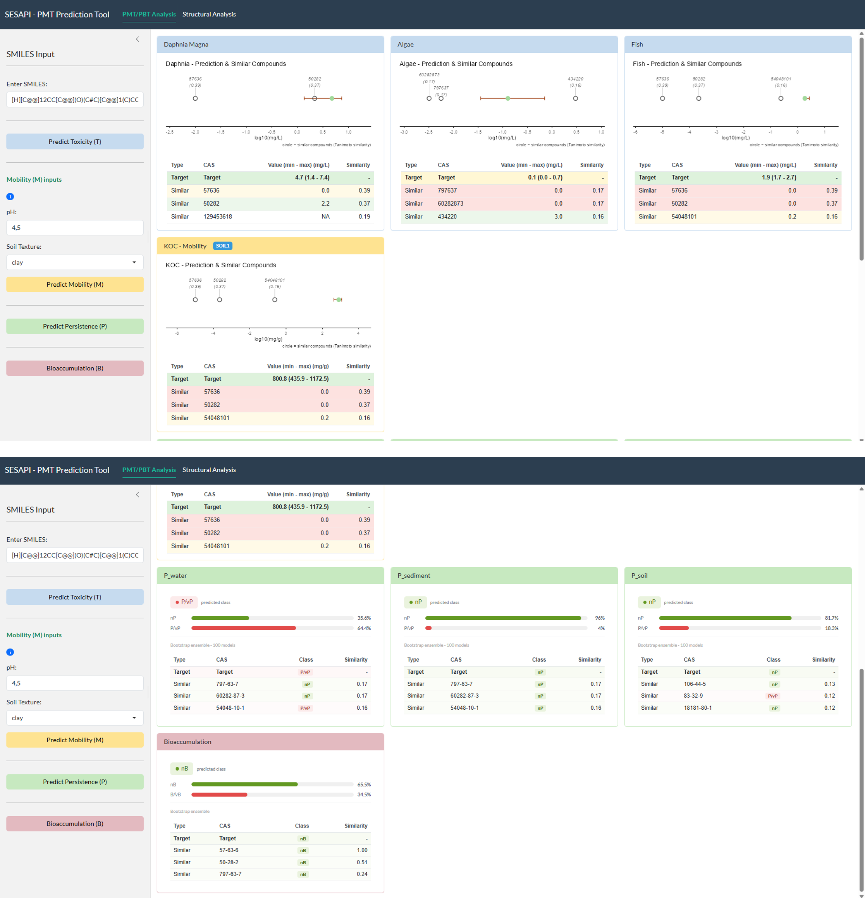
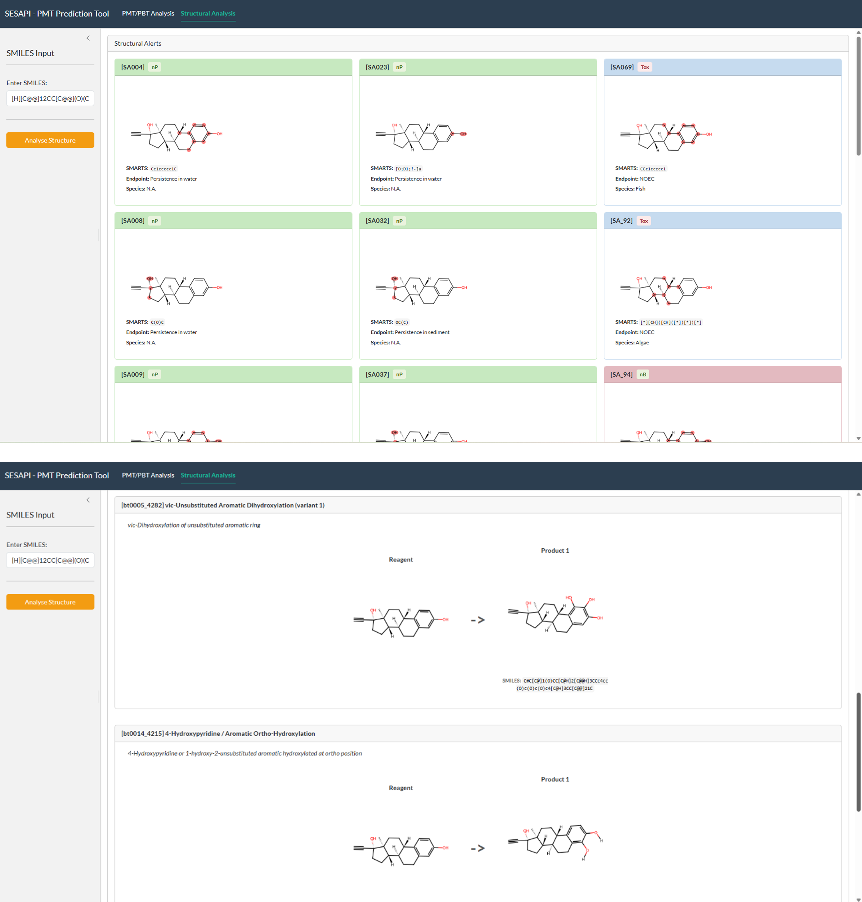

# SESAPI_PBT_PMT_evaluation

The SESAPI is tool designed to assess the PBT (Persistent, Bioaccumulative, and Toxic) and PMT (Persistent, Mobile, and Toxic) properties of substances using structural alerts and degradation pathways.

## Requirement and how to use it
You can download all the files [here](https://escher-2.marionegri.it/d/c88ead047b9546688ecc/).

### Requirement

The application requires **R**, **RStudio**, and **miniconda** for Python.
You can download R and RStudio following the instructions provided here: [R](https://cran.r-project.org/bin/windows/base/) and [RStudio](https://posit.co/downloads)
You can download Miniconda following the instructions here: [anaconda](https://www.anaconda.com/docs/getting-started/miniconda/install/windows-gui-install) 

A pre-configured Conda environment is provided in the repository as **environment.yml**. This file contains the Python dependencies required by the application.

Open the Anaconda Prompt and create the environment by copying this command:

```bash
> conda env create -f environment.yml
```
In this way, an environment named *rdkit_env* is created and will be used in the SESAPI application.

## Open SESAPI

After download all requirements, you can open with RStudio the 

## Userguide
The interface is divided into two tabs: PMT/PBT Analysis and Structural Analysis.

Within the $$\color{#4296cf}\textbf{PMT/PBT Analysis tab}$$ (Figure 1), users can perform targeted predictions for each specific criterion by following these steps:

1. **SMILES Input**: Paste the SMILES string of the target compound into the *"Enter SMILES"* text field.
2.	**Toxicity (T)**: Click the *"Predict Toxicity (T)"* button to run the chronic toxicity assessment (NOEC) of the three trophic levels (daphnia, algae, fish).
3.	**Mobility (M)**: Before assessing mobility, define the environmental parameters in the designated fields:
- pH: Enter the desired pH value (e.g., 4.5).
- Soil Texture: Select the soil type (e.g., clay, sand, etc.) from the dropdown menu.
- Click the *"Predict Mobility (M)"* button to run the calculation of Koc.
4.	**Persistence (P)**: Click the *"Predict Persistence (P)"* button to estimate the substance's environmental persistence in soil, water and sediment compartments (DT50).
5.	**Bioaccumulation (B)**: Click the *"Bioaccumulation (B)"* button to assess the bioaccumulative potential (BCF) of the molecule.

<p align="center">
  
</p>

For the regression models (Toxicity and Mobility), the graphical user interface provides the predicted numerical value alongside its associated confidence interval. A scatter plot is also displayed to visually compare the target compound against structurally similar reference molecules. Below this plot, a table lists these similar compounds, including their CAS numbers, experimental values, and Tanimoto similarity scores.
For the classification models (Persistence and Bioaccumulation), the interface provides a qualitative assessment of the substances.
Within these classification results, the interface first presents the Predicted Class, which categorizes the target compound based on specific regulatory criteria, such as nP and P/vP for persistence or nB and B/vB for bioaccumulation. Alongside this classification, a Probability Bar indicates the level of confidence in the prediction as a percentage. Finally, the Similar Compounds Table displays the closest structural analogues found in the model's training set, showing both their experimental classification and their structural similarity to the target compound.

The $$\color{#cc2d72}\textbf{Structural Analysis tab}$$ (Figure 2) allows users to identify specific structural alerts and potential degradation pathways for the target compound:
1.	SMILES Input: Enter the SMILES string of the compound in the input field on the left-side panel.
2.	Analyse Structure: Click the orange "Analyse Structure" button to run the assessment.

Once analyzed, the interface will display two main sections:
1. **Structural Alerts (SA)**: The tool scans the molecule for SA associated with specific endpoints. Each identified alert is displayed in a dedicated card containing:
  - A visual diagram of the molecule with the reactive or matching atoms highlighted.
  - The corresponding SMARTS notation.
  - The affected Endpoint and target Species (if applicable).
2.	**Reactions (SMIRKS)**: Below the SA, this section displays predicted environmental degradation pathways based on SMIRKS rules from EnviPath. It details the transformation steps, showing the initial Reagent and the predicted Products of the reaction and the SMILES of the product, that can be used to further evaluation in the SESAPI system.

<p align="center">
  
</p>
